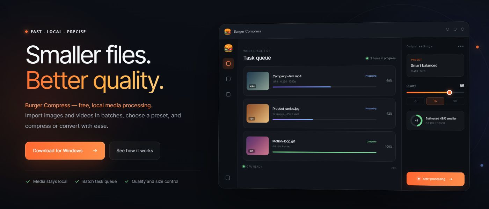

<a id="burger-compress"></a>

[](https://burgercompress.visionular.net/)

<p align="center">
  <a href="https://burgercompress.visionular.net/">
    
  </a>
</p>

<h1 align="center">Burger Compress</h1>

<p align="center">
  <strong>Smaller files. Better quality.</strong><br>
  Free, local image and video compression for Windows.
</p>

<p align="center">
  <a href="https://burgercompress.visionular.net/"><strong>Official Website</strong></a> ·
  <a href="https://burgercompress.visionular.net/download/windows">Download for Windows</a> ·
  <a href="https://github.com/visionular/BurgerCompress/releases">Releases</a> ·
  <a href="https://github.com/visionular/BurgerCompress/issues">Report an issue</a> ·
  <a href="#中文">中文</a>
</p>

## What is Burger Compress?

**[Explore Burger Compress on the official website →](https://burgercompress.visionular.net/)**

Import images and videos in batches, choose a preset, and compress or convert with ease.

Burger Compress is a free Windows desktop app for compressing and converting images and videos in batches. Media processing runs locally by default: source files, thumbnails, paths, processing history, and output files are not uploaded to Burger Compress servers.

### Highlights

- Batch image and video processing with a clear queue, progress, elapsed time, and output status.
- Practical presets for balanced results, higher quality, faster processing, or smaller files.
- Quality-based controls for images and videos, plus target-size control for supported image workflows.
- Local-first processing, with source files never overwritten by default.
- Optional sign-in for syncing personal advanced templates; media files are not included in template sync.
- English and Simplified Chinese interface.

## Download

### Windows 11 (x64)

[**Download the latest Windows installer**](https://burgercompress.visionular.net/download/windows)

Current public build: **v0.1.18**

| Item         | Value                                                              |
| ------------ | ------------------------------------------------------------------ |
| Installer    | `Burger-Compress-0.1.18-Setup-x64.exe`                             |
| Architecture | Windows x64                                                        |
| Size         | 116,696,527 bytes (about 111.3 MiB)                                |
| SHA-256      | `2FB03D46A836C31E8B026B5BEF4E6BC8643E4B5ED5F751438169BF58C3A73A21` |

Verify the download in PowerShell:

```powershell
Get-FileHash .\Burger-Compress-0.1.18-Setup-x64.exe -Algorithm SHA256
```

The returned hash should exactly match the value above. If it does not, do not run the installer.

## How it works

1. Add one or more image or video files.
2. Choose an output format and a preset, then adjust quality or supported advanced options if needed.
3. Select an output location and start processing. Burger Compress publishes completed outputs without overwriting source files by default.

## Supported source formats

| Category | Recognized source formats                                         |
| -------- | ----------------------------------------------------------------- |
| Video    | MP4, MKV, MOV, M4V, AVI, FLV, M2TS, MTS, TS, 3GP, 3G2             |
| Image    | JPG, JPEG, WEBP, AVIF, HEIC, HEIF, PNG, APNG, BMP, TIF, TIFF, GIF |

Available output formats, codecs, filters, and hardware acceleration can vary by source media and the capabilities detected on the current computer.

## Privacy and accounts

- Guest use supports unlimited local media processing.
- Signing in is required only for personal advanced templates and settings sync.
- Synced settings do not include media files, thumbnails, local paths, or processing history.
- One account can have up to five active devices.

Read the current [Privacy Notice](https://burgercompress.visionular.net/privacy) and [Terms of Service](https://burgercompress.visionular.net/terms).

## Support and security

- For normal product problems, read [Support](SUPPORT.md) and open a [GitHub issue](https://github.com/visionular/BurgerCompress/issues/new/choose).
- For security vulnerabilities, account problems, or privacy requests, follow [Security](SECURITY.md) or email [info@visionular.com](mailto:info@visionular.com).
- Product website: [burgercompress.visionular.net](https://burgercompress.visionular.net/)

## License and distribution

This is the official public distribution and support repository for Burger Compress. It contains release information and user-facing documentation, not the proprietary application source code.

Burger Compress is free to use but is **proprietary, closed-source software**. Free use does not grant an open-source license. Unless applicable law or written authorization from Visionular permits otherwise, you may not copy, modify, reverse engineer, repackage, redistribute, sublicense, or resell the application or its components.

Copyright © Visionular. All rights reserved.

---

<a id="中文"></a>

<p align="center">
  <a href="https://burgercompress.visionular.net/">
    
  </a>
</p>

<h1 align="center">汉堡压缩</h1>

<p align="center">
  <strong>体积更小，画质更好。</strong><br>
  免费、本地处理的 Windows 图片与视频压缩工具。
</p>

<p align="center">
  <a href="https://burgercompress.visionular.net/"><strong>官方网站</strong></a> ·
  <a href="https://burgercompress.visionular.net/download/windows">下载 Windows 版</a> ·
  <a href="https://github.com/visionular/BurgerCompress/releases">版本发布</a> ·
  <a href="https://github.com/visionular/BurgerCompress/issues">反馈问题</a> ·
  <a href="#burger-compress">English</a>
</p>

## 汉堡压缩是什么？

**[前往官方网站，了解汉堡压缩 →](https://burgercompress.visionular.net/)**

批量导入图片与视频，选择预设，轻松完成压缩或格式转换。

汉堡压缩是一款免费的 Windows 桌面软件，可以批量压缩和转换图片、视频。媒体处理默认在本机完成：源文件、缩略图、文件路径、处理历史和输出文件不会上传到汉堡压缩服务器。

### 主要特点

- 批量处理图片和视频，并清晰展示队列、进度、用时和输出状态。
- 提供均衡、质量优先、速度优先和体积优先等实用预设。
- 支持图片和视频的质量控制，并在受支持的图片流程中提供目标体积控制。
- 本地优先处理，默认不会覆盖源文件。
- 可选登录，用于同步个人高级模板；同步内容不包含媒体文件。
- 提供英文和简体中文界面。

## 下载

### Windows 11（x64）

[**下载最新版 Windows 安装程序**](https://burgercompress.visionular.net/download/windows)

当前公开版本：**v0.1.18**

| 项目     | 内容                                                               |
| -------- | ------------------------------------------------------------------ |
| 安装程序 | `Burger-Compress-0.1.18-Setup-x64.exe`                             |
| 架构     | Windows x64                                                        |
| 文件大小 | 116,696,527 字节（约 111.3 MiB）                                   |
| SHA-256  | `2FB03D46A836C31E8B026B5BEF4E6BC8643E4B5ED5F751438169BF58C3A73A21` |

在 PowerShell 中校验下载文件：

```powershell
Get-FileHash .\Burger-Compress-0.1.18-Setup-x64.exe -Algorithm SHA256
```

返回的哈希值应与上表完全一致。如果不一致，请勿运行安装程序。

## 使用流程

1. 添加一个或多个图片、视频文件。
2. 选择输出格式和预设，按需调整质量或受支持的高级选项。
3. 选择输出位置并开始处理。默认情况下，汉堡压缩会发布新的输出文件，不覆盖源文件。

## 支持识别的源文件格式

| 分类 | 支持识别的源格式                                                  |
| ---- | ----------------------------------------------------------------- |
| 视频 | MP4、MKV、MOV、M4V、AVI、FLV、M2TS、MTS、TS、3GP、3G2             |
| 图片 | JPG、JPEG、WEBP、AVIF、HEIC、HEIF、PNG、APNG、BMP、TIF、TIFF、GIF |

实际可用的输出格式、编码器、滤镜和硬件加速能力，会根据源媒体以及当前电脑检测到的运行能力而变化。

## 隐私与账户

- 游客模式可以不限次数地进行本地媒体处理。
- 只有使用个人高级模板和设置同步时才需要登录。
- 同步设置不包含媒体文件、缩略图、本地路径或处理历史。
- 一个账户最多可以保有五台活跃设备。

请阅读当前的[隐私说明](https://burgercompress.visionular.net/privacy)和[服务条款](https://burgercompress.visionular.net/terms)。

## 支持与安全

- 一般产品问题请先阅读[支持说明](SUPPORT.md)，再提交 [GitHub Issue](https://github.com/visionular/BurgerCompress/issues/new/choose)。
- 安全漏洞、账户问题或隐私请求，请按照[安全说明](SECURITY.md)联系，或发送邮件至 [info@visionular.com](mailto:info@visionular.com)。
- 产品官网：[burgercompress.visionular.net](https://burgercompress.visionular.net/)

## 许可与分发

这是 Burger Compress（汉堡压缩）的官方公开分发与支持仓库，用于提供版本信息和面向用户的文档，不包含闭源应用程序的源代码。

Burger Compress（汉堡压缩）可以免费使用，但属于 **专有闭源软件**。免费使用不等于授予开源许可。除非适用法律或 Visionular 的书面授权另有允许，不得复制、修改、逆向工程、重新打包、再分发、转授权、转售本软件或其组成部分。

版权所有 © Visionular。保留所有权利。
